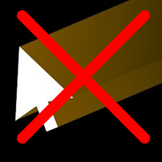

# Lock Mouse Cursor
A mod that allow to lock the mouse cursor in place while playing. 
When you have two monitor this prevent to click outside of your game on the second monitor and exiting the game while playing.




## Build instructions
Just follow the [Getting Started](https://docs.geode-sdk.org/getting-started/) from the geode doc then : 
```sh
geode build
```

# Resources
* [Geode](https://docs.geode-sdk.org/) For providing the modding toolkit
* [GD-Mouse-Lock](https://github.com/FigmentBoy/GD-Mouse-Lock/tree/master) The original idea came from here. It was an external program that achieved similar functionality but is no longer maintained and lacked options for 2-player levels.